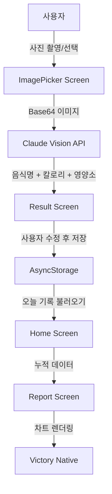

<!-- 생성일시: 2026-05-19 -->

# 시스템 아키텍처 (내부 참조용)

## 전체 구조



## 레이어 구조

```
NutriSnap/
├── app/                     # Expo Router 화면
│   ├── (tabs)/
│   │   ├── index.tsx        # 홈 (오늘 식단 + 칼로리 진행률)
│   │   ├── add.tsx          # 음식 추가 (사진 → AI 인식)
│   │   └── report.tsx       # 주간 리포트
│   └── _layout.tsx
│
├── src/
│   ├── api/
│   │   └── claude.ts        # Claude Vision API 호출
│   ├── storage/
│   │   └── mealStorage.ts   # AsyncStorage CRUD
│   ├── utils/
│   │   └── nutrition.ts     # 칼로리/영양소 계산 유틸
│   └── types/
│       └── index.ts         # 공통 타입 정의
│
└── constants/
    └── config.ts            # API 키, 목표 칼로리 기본값
```

## 데이터 흐름

### 음식 기록 플로우
```
1. 사용자가 사진 선택
2. expo-image-picker → URI 획득
3. FileSystem.readAsStringAsync → Base64 변환
4. Claude API 호출 (image + prompt)
5. 응답 파싱 → { name, calories, carbs, protein, fat }
6. 사용자 확인/수정
7. AsyncStorage에 저장 (날짜별 키)
```

### 데이터 스키마

```typescript
interface Meal {
  id: string;           // UUID
  date: string;         // "2026-05-19"
  mealType: 'breakfast' | 'lunch' | 'dinner' | 'snack';
  foods: FoodItem[];
  createdAt: number;    // timestamp
}

interface FoodItem {
  name: string;         // "비빔밥"
  amount: string;       // "1인분 (300g)"
  calories: number;     // 550
  carbs: number;        // 80
  protein: number;      // 15
  fat: number;          // 12
}
```

## Claude API 프롬프트 설계

```
시스템: 너는 영양사 AI야. 음식 사진을 보고 JSON으로만 응답해.

사용자: [이미지 첨부]
이 음식들의 이름, 칼로리, 탄수화물, 단백질, 지방을 분석해줘.
1인분 기준으로 계산하고, 한국 음식이면 한국 이름으로 표기해.

응답 형식:
{
  "foods": [
    {
      "name": "비빔밥",
      "amount": "1인분 (300g)",
      "calories": 550,
      "carbs": 80,
      "protein": 15,
      "fat": 12
    }
  ]
}
```
