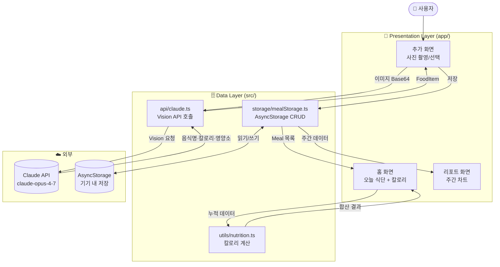

<!-- 생성일시: 2026-05-19 -->

# 아키텍처 개요

## NutriSnap이란

사진 한 장으로 음식을 인식하고 칼로리·영양소를 자동 계산하는 AI 식단 트래커 모바일 앱.

## 시스템 다이어그램



## 기술 스택

| 구분 | 기술 | 버전 |
|---|---|---|
| 플랫폼 | React Native + Expo | SDK 53 |
| 언어 | TypeScript | 5.x |
| AI | Anthropic Claude API | claude-opus-4-7 |
| 로컬 저장소 | AsyncStorage | - |
| 차트 | Victory Native | - |
| 네비게이션 | Expo Router | - |

## 화면 구성

```
앱 실행
└── 탭 네비게이션
    ├── 홈 탭 (index.tsx)
    │   - 오늘 날짜 + 목표 칼로리 Progress Bar
    │   - 식사별 기록 목록 (아침/점심/저녁/간식)
    │   - 총 칼로리 / 탄단지 요약
    │
    ├── 추가 탭 (add.tsx)
    │   - 카메라 / 갤러리 선택
    │   - AI 분석 결과 표시 + 수정
    │   - 식사 유형 선택 후 저장
    │
    └── 리포트 탭 (report.tsx)
        - 주간 칼로리 막대 차트
        - 주간 영양소 평균 도넛 차트
```

## 핵심 모듈 설명

### `src/api/claude.ts`
Claude Vision API 호출 담당. 이미지 Base64와 프롬프트를 전달하고, 음식 정보 JSON을 파싱해서 반환한다.

### `src/storage/mealStorage.ts`
AsyncStorage 읽기/쓰기 추상화. 날짜 문자열을 키로 사용해 일별 식단 데이터를 관리한다.

### `src/utils/nutrition.ts`
음식 목록에서 총 칼로리, 탄수화물, 단백질, 지방을 합산하는 계산 유틸.

### `src/types/index.ts`
`Meal`, `FoodItem` 등 앱 전역 타입 정의.

## 의사결정 기록

- [ADR-0001](../.planning/decisions/ADR-0001-platform.md) — React Native + Expo 선택 이유
- [ADR-0002](../.planning/decisions/ADR-0002-ai-api.md) — Claude API 선택 이유
- [ADR-0003](../.planning/decisions/ADR-0003-storage.md) — AsyncStorage 선택 이유 (서버리스)
