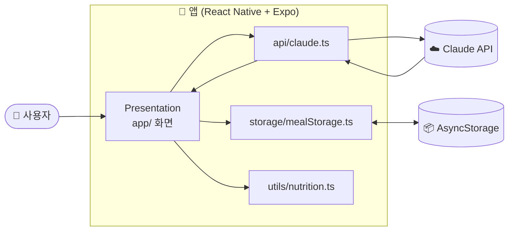

<!-- 생성일시: 2026-05-19 -->
---
marp: true
theme: default
paginate: true
size: 16:9
header: "NutriSnap — 중간 발표"
footer: "AI 식단·칼로리 트래커 | kjoon0483"
---

<!-- _class: lead -->

# NutriSnap
## AI 식단·칼로리 트래커

사진 한 장으로 음식을 인식하고 칼로리와 영양소를 자동 계산하는 모바일 앱

---

## 문제 정의

  

    01
    <h3>기록이 귀찮다</h3>
    
음식명과 양을 매번 직접 입력해야 해서 지속하기 어렵다

  

  

    02
    <h3>검색이 번거롭다</h3>
    
칼로리를 일일이 검색해야 해서 꾸준한 관리가 힘들다

  

  

    03
    <h3>균형 파악이 어렵다</h3>
    
영양 불균형 여부를 직관적으로 확인할 방법이 없다

  

  💡 핵심 가설 — 사진 찍기만 하면 자동으로 기록된다면, 식단 관리를 꾸준히 할 수 있다

---

## 솔루션

  
📷음식 촬영

  →
  
🤖AI 자동 인식

  →
  
🔢칼로리 계산

  →
  
✏️수정 & 저장

  →
  
📊주간 리포트

---

## 아키텍처

---

## ADR — 핵심 의사결정 3가지

  

    
ADR-0001 · 플랫폼

    <h3>모바일 프레임워크</h3>
    ✅ React Native + Expo
    
vs Flutter · 네이티브

    
기존 JS 지식 재활용 + Claude 공식 JS SDK 사용 가능

  

  

    
ADR-0002 · AI

    <h3>Vision AI API</h3>
    ✅ Claude API
    
vs GPT-4 Vision · Gemini

    
한식 인식 품질 우수 + JSON 응답 안정성 높음

  

  

    
ADR-0003 · 저장소

    <h3>데이터 저장</h3>
    ✅ AsyncStorage
    
vs Firebase · 자체 서버

    
서버 없이 기기 내 저장 — 6주 일정 내 구현 가능

  

---

## 진행 현황

| 항목 | 완료 |
|---|---|
| 비전 / 요구사항 / WBS / 일정 문서 | ✅ |
| 아키텍처 문서 + ADR 3개 | ✅ |
| setup / deploy / testing 문서 | ✅ |
| AGENTS.md / README / AUTHORING | ✅ |
| Expo 프로젝트 초기화 + 패키지 설치 | ✅ |
| Claude API 연동 모듈 (`src/api/`) | ✅ |
| 화면 개발 (홈 / 추가 / 리포트) | 🔄 진행 중 |

---

## 데모

> (실기기 또는 시뮬레이터 화면 시연)

- 음식 사진 업로드 → Claude Vision 인식 결과 표시
- 하루 식단 목록 + 칼로리 합계

---

## 다음 단계 (13~14주차)

1. 탄·단·지 차트 시각화 (Victory Native)
2. 주간 리포트 화면
3. 에러 처리 / 로딩 UI 개선
4. 최종 발표 자료 준비

---

## Q&A 대비 — 개발자 기본 소양

| 예상 질문 | 답변 위치 |
|---|---|
| 왜 React Native + Expo? | ADR-0001 |
| 왜 Claude API? | ADR-0002 |
| 데이터는 어디에 저장? | ADR-0003 |
| 환경 설정은? | docs/setup.md |
| 배포는 어떻게? | docs/deploy.md |
| 테스트는? | docs/testing.md |
